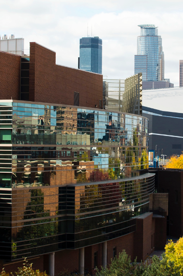

<!-- 
Colors:
Maroon: #7a0019
Gold: #ffcc33
Dark Maroon: #5b0013
Dark Gold: #ffb71e
Dark Gray: #5a5a5a
Darker Gray: #333333
Medium Gray: #777677
Light Maroon: #900021
Light Gold: #ffde7a
Light Gray: #d5d6d2
Lighter Gray: #f0efee
Off White: #f9f7f6

-->
<!-- _class: lead -->
<!-- _header: "" -->
<!-- _backgroundColor: #7a0019 -->
<!-- _color: #fff -->
# Agile Methods Introduction

IDSC 4471 - Agile Methods
Sean Dulin

---

# <!--fit-->**What do these things have in common?**

<!-- get images and do vertical split of all three -->

---

# **Welcome**

 - Who are we?
 - What is Agile Methods
 - Course Tools & Logistics
 - Topic Overviews

---

# **Sean Dulin**
* Carlson School BSB - 2009

* General Mills - 2008 - 2021
    * Developer -> Lead
    * IT Analyst -> Manager
    * Solution Architect
    * Data Architect

* Basketful -> SmartCommerce
    * Shoppable Recipes
    * Shoppable Links
    * Product Locator
    * Insights

<!-- 
    This is essentially my linked in profile.  I also worked at Carlson as a student web developer on systems like the Carlson public homepage (before the current technology), a version of the alumni network application, the learning management system before we used Moodle, and the MBA application student tracking system.  It was in that role that I first started using Agile.  My first role at General Mills was where I had a team lead who was also an early Agile advocate and coach.  His role after he left my team was self titled “Agile Bigot”.  I moved onto a project team where we used Agile processes for a couple of years with a relatively stable team.  I did a host of other projects using Agile processes right as General Mills was moving from bottoms up Agile to a more tops down understanding.  I was an early consultant for the team working to provide best practices for Agile to all of IT.  I was an early Agile coach – not as a formal role, but as a helper to teams that were just adopting Agile.  While moving into the Supply Chain space as an analyst and as a manager, I helped move my team and surround teams to adopt more agile processes.  My immediate team was much easier because they were already doing the process, they just had a different vocabulary for it.  Now as a solution architect on product information, I provide technical and business process architecture as well as technical coaching for two teams that both use different levels of agile processes.

    I’ve taught this particular course once before and played the role of product owner for this course twice before when Corrie F was teaching it. 
-->
<!-- TODO: Put another slide here with other interests -->

---

# **Who are you**
<!-- TODO: Put up DirectPoll link -->

---

# **Agile Software Development**
<!-- _class: hideBullets -->
### :heart: Care about people
### :bangbang: Prioritize value
### :busts_in_silhouette: Collaborate
### :roller_coaster: Respond to change
<!-- Almost 20 years old
We’ll talk more next Tuesday about this
Over 50% of IT projects are being run in an Agile-ish way
Agile is growing while traditional methods are getting less common
 -->

---

# **We're in Sprint 0**
 - We will adapt as we go
 - I need people to speak up if it's not working
 - If you wonder why, other people probably do to - ASK!

---

# **Canvas**
 - Can you get in?
 - Organizational Strategy
     - Announcements
     - Modules
     - Discussions
     - Assignments

---

<!-- TODO: background image of the homepage -->

---

<!-- TODO: background image of the modules page -->

---

<!-- TODO: background image of the welcome lecture page -->

---

<!-- TODO: background image of the discussions page -->

---

# **Deliverables**
 - Attendance / Participation
    - Show up, give thoughts, exit ticket
 - Homework
 - Midterm
 - Agile Topic Presentation
 - Final

 <!-- 
 Attendance and Participation
Attend via Zoom
If you are ill or caring for someone who is ill, the lectures will be recorded – this should be reserved for those that are in this situation
I’d like advance notice of you missing the class – ideally 24 hours
Participation is based on you asking questions, providing your thoughts, etc.
This should earn you 3 or 4 points
An extra point is available by submitting questions via Canvas meant to be used on the midterm or final
3 or 4 questions is enough

Homework
This is similar to every other class
See notes about team sprint

Exams
The midterm will be done via Canvas the week of April 6.
The final exam will be done via Canvas either on a scheduled day or similar to midterm – it depends on how it goes.
Exams are a combination of multiple choice and short answer questions to test your grasp of the theory and (mostly) the practice of Agile methods.
Exams will be timed, so while you might be able to use lots of notes, the time will work against you.
Exams will be administered electronically.  
The midterm exam will be about 30 minutes.  It is low-stakes.  The primary purpose is to ensure you understand my exam style.
The final exam will be about 60 or 75 minutes.

Team Sprint
Each team will be responsible for one lecture.  
The particular date will be picked early in the course.  The team will be responsible for selecting and sizing the user story(ies), building a description and acceptance criteria, and developing the story.
In class, the team will present the topic and teach it to the rest of the class.  They can use pre-readings, homework, in-class exercises, or input from external speakers to teach the class.  The team will then ensure they have met the acceptance criteria to complete the story.

Definition of Done: User stories assigned one week before lecture, story description and acceptance criteria approved three days before lecture, pre-readings and lecture materials submitted one day before lecture, and homework uploaded day of lecture, acceptance criteria met with approval from product owner or proxy.

Agile Topic Presentation
Each team will identify an epic related to emerging Agile trends or tools.  
All deliverables (except the final presentation) are due on Friday night at 11:59pm. 
On March 27, you need to have a topic picked and sent to Sean.  
It’s first come first serve – if you pick a topic someone else has picked, I’ll ask you to choose another  
You can change or refine the topic as you go with Sean's approval, however the closer you get to the final presentation, the harder this will become.
Each Friday following March 27 (April 3, April 10, etc) until the final presentation, you are required to submit evidence of progress via submission of agile activities.  
Evidence is due each Friday evening by 11:59pm
 -->

---

# **Logistics**
 - Meet twice a week
 - Lectures planned from Epic breakdown
 - Lectures built as user stories
 - Readings posted online
     - Expectation: You've read them before class
 - Homework due within a week
    - Assigned March 14, due March 21
<!-- Since work is due within a week, I will commit to returned within a week -->

---

# **Attendance and Late Work**
 - Please attend class
    - Advance notice where possible
    - Once you can safely contact me
    - Class will be recorded
 - Late work will not be accepted
    - Advance notice where possbile
    - Once you can safely contact me
    - Habitutual issues will generate a discussion
<!-- 
    Even though class is being recorded, I will not be doing Zoom classes (with one exception)
    If you are ill, let me know, watch the recording
    You'll miss the exit ticket stuff, but we can talk about that
-->
---

# **Grading**
|Points|%-age |                                 |
|-----:|:----:|:--------------------------------|
|170   |37.78%|Agile Topic Presentation         |
|150   |33.33%|Exams (30 - midterm, 120 - final)|
|130   |28.89%|Participatino and Homework       |

---

# **Grading**
|%-age|Grade|
|-----|-----|
|>=93%|A    |
|>=90%|A-   |
|>=87%|B+   |
|>=83%|B    |
|>=80%|B-   |
|>=77%|C+   |

<!-- 
A Final course grades are performance-based. Your grade is based solely on your performance: thus collaboration and team-work are highly encouraged.
 
At my discretion, these targets may be moved down, but will not be moved up.
 
The University defines C level effort as work that "meets the course requirements in every respect." Based on this definition, students expecting an A or B level grade in the course should be prepared to demonstrate learning above and beyond the classroom.
-->
---

# **Agile Trade Show**
In case I forget to walk through this before

---

# **Stress**

# 🆘
Donna Kulakowski is CSOM's wellness counselor

# ☎️
Any Carlson undergraduate is welcome to schedule an appointment by calling 612-624-3323

# 🚫
All services are free and completely confidential

<!-- 
At times, we all can feel stressed out, anxious, depressed or overwhelmed. Sometimes these problems go away or their own, and there are times when these issues don't resolve or they get in the way of our ability to do our best in school and in life.
When this occurs it may be time to seek professional help.
Donna Kulakowski is CSOM's wellness counselor. She is available to meet with any enrolled undergraduate who might find themselves struggling with issues that interfere with school or life. Her office is located in the Academic Advising suite, HMH 2-190. Any Carlson undergraduate is welcome to schedule an appointment by calling 612-624-3323. All services are free and completely confidential.
-->

---

# **Epics / Topics**

---

# **Homework**
<!-- _class: hideBullets -->
 ### :envelope:Submit your team via Canvas by March 18
 - If you can't find a team email me by EOD, March 16
 
 ### :flashlight:Begin thinking about a topic for your Agile Presentation <!--fit-->
  - Examples will be posted (and crossed out) in discussion thread
  - **Topic will be due March 24**